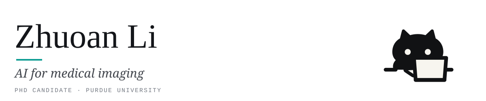

<picture>
  <source media="(prefers-color-scheme: dark)" srcset="banner-dark.svg">
  
</picture>

I am a PhD candidate in Biomedical Engineering at Purdue University. I develop
and evaluate AI methods for medical imaging, with a focus on cardiac MRI. My
research spans foundation models, automated image analysis, and quantitative
biomarker estimation, emphasizing model reliability and multicenter
validation.

### Selected work

- [**4DCMR-Segmentation-via-Foundation-Model**](https://github.com/zhuoanli/4DCMR-Segmentation-via-Foundation-Model):
  zero-shot full-cycle 4D cine CMR segmentation with dual-anchored MedSAM2,
  reaching 0.850 RV Dice on ACDC with no cardiac-specific training.
  *MIUA 2026, main track (oral)*

- [**CycleQA**](https://github.com/zhuoanli/CycleQA): label-free cross-vendor
  quality assessment from propagation disagreement, detecting failures at AUROC
  0.850 on 320 unseen-vendor patients without reference segmentations at
  inference. *MIUA 2026, MÉTIS special session*

- [**Stress-perfusion CMR classification with a CMR foundation model**](https://www.journalofcmr.com/article/S1097-6647%2825%2900399-0/fulltext):
  fine-tuning a cine-pretrained foundation model to flag abnormal perfusion
  series in the SCMR Registry, now extending to segment-level localization of
  perfusion abnormalities. *SCMR 2026 (oral)*

- **LLM reasoning for cardiac pathology classification** from
  segmentation-derived metrics. *MIUA 2026, short paper*

- **Blood-sampling-free myocardial ECV estimation** across 9,700 multicenter
  examinations. *ISMRM 2026 oral, Summa Cum Laude Merit Award*

### Contact

<a href="https://zhuoanli.github.io"><picture><source media="(prefers-color-scheme: dark)" srcset="btn-site-dark.svg"></picture></a> <a href="https://www.linkedin.com/in/zhuoan-li-lza1207/"><picture><source media="(prefers-color-scheme: dark)" srcset="btn-linkedin-dark.svg"></picture></a>

The cat also runs my website.
